<!--
Generated by Merlin Studio (https://app.merlin-studio.cloud).
Licensed under the Apache License, Version 2.0 (https://www.apache.org/licenses/LICENSE-2.0).
-->

# AWS EU-Bank Landing Zone — Merlin Studio Example

A complete, regulated **AWS multi-account landing zone** for a fictional European
bank (**AcmeBank**), generated by [**Merlin Studio**](https://app.merlin-studio.cloud)
from a single intent spec and emitted in **two infrastructure-as-code formats**.
It is the AWS port of the same bank profile as
[`GCP-PCI-EUCS-Bank-Example`](https://github.com/Merlin-Studio/GCP-PCI-EUCS-Bank-Example) —
one spec, two clouds.

This repository is a **reference example** — it shows what Merlin produces for a
PCI DSS + ISO 27001 + CIS + EUCS + GDPR banking workload, with DORA's resilience
obligations reflected in the DR and logging choices: account hierarchy with a
dedicated cardholder-data account, EU-only regions, centralized egress inspection,
immutable audit logging, and the compliance reasoning behind every value.

> **Not a turnkey deployment.** All real AWS identifiers are stubbed as
> `PLACEHOLDER_*` tokens and all contact addresses use the fictional
> `acmebank.com` domain. See each format's `PLACEHOLDERS.md` before attempting
> to deploy. On-premises connectivity (Direct Connect / VPN) is intentionally
> out of scope for this example.

---

## The scenario

| | |
|---|---|
| **Organization** | AcmeBank (fictional EU bank, backend foundation) |
| **Profile** | advanced (enterprise) |
| **Compliance** | PCI DSS · ISO 27001 · CIS · EUCS · GDPR |
| **Home region** | eu-central-1 (Frankfurt) |
| **Enabled regions** | eu-central-1, eu-west-3 (Paris, DR), eu-west-1 |
| **DR posture** | Multi-region warm standby (eu-west-3), HSM-grade CMKs, 10-year audit retention |
| **Headline control** | Dedicated, isolated **PciWorkload** account + `pci-cde` VPC (PCI-DSS 4.0 CDE boundary) |
| **Security scorecard** | **97/100 (A+)** — 349 passed · 1 warned · 0 failed |

---

## What fired — the eight controls a EU bank reviewer checks first

Every value below was derived deterministically from the discovery answers plus
the selected frameworks. Each line names the rule that fired and the file where
it landed (OpenTofu paths shown; the LZA config expresses the same intent).
✅ = in the IaC as generated · 📋 = documented posture, to be finished by your team.

| # | Control | What fired | Where it landed |
|---|---------|------------|-----------------|
| 1 | ✅ PCI/CDE segmentation | PCI DSS 4.0 scoping → dedicated `PciWorkload` account in its own `Workloads/Prod/PCI` OU with an isolated `pci-cde` VPC (10.2.0.0/16), SAQ-D scope kept away from every other workload | [`OpenTofu/aws-opentofu/accounts.tf`](OpenTofu/aws-opentofu/accounts.tf), [`LZA/aws-lza/accounts-config.yaml`](LZA/aws-lza/accounts-config.yaml) |
| 2 | ✅ EU region lock | GDPR Art. 44–49 + EUCS sovereignty → root-level SCP denying every request outside the eight EU regions | [`LZA/aws-lza/service-control-policies/region-restriction-eu.json`](LZA/aws-lza/service-control-policies/region-restriction-eu.json) |
| 3 | ✅/📋 CMKs, HSM-grade | PCI Req 3 + EUCS CRY → per-service customer-managed keys; CIS 3.8 → 90-day rotation (strictest framework wins). A CloudHSM-backed custom key store is the documented upgrade path | [`OpenTofu/aws-opentofu/kms.tf`](OpenTofu/aws-opentofu/kms.tf), [`LZA/aws-lza/kms/central-logs-key-policy.json`](LZA/aws-lza/kms/central-logs-key-policy.json) |
| 4 | ✅ Centralized egress inspection | Advanced profile + PCI network segmentation → dedicated inspection VPC with **AWS Network Firewall**, Transit Gateway routes all inter-VPC and egress traffic through it; no internet gateways in workload VPCs | [`OpenTofu/aws-opentofu/inspection_vpc.tf`](OpenTofu/aws-opentofu/inspection_vpc.tf), [`network_firewall.tf`](OpenTofu/aws-opentofu/network_firewall.tf), [`transit_gateway_inspection.tf`](OpenTofu/aws-opentofu/transit_gateway_inspection.tf) |
| 5 | ✅ Immutable long-retention audit logs | PCI Req 10 + EUCS logging + DORA traceability → org CloudTrail (all regions, management events) into a central S3 bucket with **Object Lock in COMPLIANCE mode** and CMK encryption, 10-year retention | [`OpenTofu/aws-opentofu/s3_log_archive.tf`](OpenTofu/aws-opentofu/s3_log_archive.tf), [`cloudtrail.tf`](OpenTofu/aws-opentofu/cloudtrail.tf) |
| 6 | ✅ Data discovery for PAN/PII | PCI Req 3 + GDPR → **Macie** org-wide on S3, delegated to the Audit account, alongside GuardDuty, Security Hub (PCI DSS + CIS standards), Inspector and Access Analyzer | [`OpenTofu/aws-opentofu/security.tf`](OpenTofu/aws-opentofu/security.tf), [`LZA/aws-lza/security-config.yaml`](LZA/aws-lza/security-config.yaml) |
| 7 | ✅/📋 MFA + privileged access | ISO 27001 A.5.15 + PCI Req 8 → IAM Identity Center SSO permission sets (no IAM users), deny-root SCP, IMDSv2 required; MFA/FIDO enforcement for privileged sets is configured in the Identity Center console (documented) | [`OpenTofu/aws-opentofu/iam.tf`](OpenTofu/aws-opentofu/iam.tf), [`LZA/aws-lza/scp/deny-root.json`](LZA/aws-lza/scp/deny-root.json) |
| 8 | ✅ Dual-region resilience | Warm-standby DR (DORA/EUCS availability) → second Transit Gateway in eu-west-3 peered to primary, western VPCs for hub and workloads, central **Backup vault with Vault Lock** and org-level daily backup policy | [`OpenTofu/aws-opentofu/transit_gateway.tf`](OpenTofu/aws-opentofu/transit_gateway.tf), [`backup.tf`](OpenTofu/aws-opentofu/backup.tf), [`LZA/aws-lza/backup-policies/org-backup-daily.json`](LZA/aws-lza/backup-policies/org-backup-daily.json) |

The full framework-by-framework value trace is in
[`COMPLIANCE_UPGRADES.md`](./COMPLIANCE_UPGRADES.md), and each format's README
carries a per-section "what fired for your spec" table.

---

## Two formats, one spec

The same intent compiles to two independent deployment paradigms. Pick the one
that matches your stack — each folder is self-contained with its own README,
deployment guide, scorecards, placeholder list and architecture diagram.

| Format | Folder | What it is | Best for |
|---|---|---|---|
| **LZA** | [`LZA/`](./LZA) | AWS Control Tower + Landing Zone Accelerator (declarative YAML) | Regulated enterprises standardizing on AWS-native governance |
| **OpenTofu** | [`OpenTofu/`](./OpenTofu) | OpenTofu + Spacelift (HCL + per-stack YAML) | Teams standardized on Terraform/OpenTofu IaC |

Shared, format-neutral artifacts live at the repository root:

- [`COMPLIANCE_UPGRADES.md`](./COMPLIANCE_UPGRADES.md) — every value a compliance framework forced
- [`NETWORK_TOPOLOGY.md`](./NETWORK_TOPOLOGY.md) — VPCs, CIDRs, Transit Gateway, and DR layout

---

## Architecture

The OpenTofu variant is rendered below; the LZA variant sits at
[`LZA/architecture.mmd`](./LZA/architecture.mmd).

```mermaid
graph TD
    %% AWS Organizations
    Org[AWS Organizations<br/>AcmeBank]:::org

    %% OUs
    Org --> OU_Security[Security OU]:::ou
    Org --> OU_Workloads[Workloads OU]:::ou
    Org --> OU_Infra[Infrastructure OU]:::ou
    Org --> OU_Suspended[Suspended OU]:::ou

    %% Mandatory accounts under Security
    OU_Security --> Acct_LogArchive[LogArchive<br/>Account]:::account
    OU_Security --> Acct_Audit[Audit<br/>Account]:::account

    OU_Infra --> Acct_SharedServices[SharedServices<br/>Account]:::account
    OU_Infra --> Acct_Network[Network<br/>Account]:::account
    OU_Workloads --> OU_Workloads_Sandbox[Sandbox]:::ou
    OU_Workloads --> OU_Workloads_Dev[Dev]:::ou
    OU_Workloads --> OU_Workloads_Staging[Staging]:::ou
    OU_Workloads --> OU_Workloads_Prod[Prod]:::ou

    OU_Workloads --> Acct_Pciworkload[PciWorkload<br/>Account]:::account
    OU_Workloads_Dev --> Acct_Appdev[AppDev<br/>Account]:::account
    OU_Workloads_Staging --> Acct_Appstaging[AppStaging<br/>Account]:::account
    OU_Workloads_Prod --> Acct_Appprod[AppProd<br/>Account]:::account
    OU_Workloads_Sandbox --> Acct_Appsandbox[AppSandbox<br/>Account]:::account

    %% Security services (run from Audit account)
    Acct_Audit -.delegated.-> GuardDuty[GuardDuty]:::service
    Acct_Audit -.delegated.-> SecurityHub[Security Hub]:::service
    Acct_Audit -.delegated.-> Config[AWS Config<br/>Aggregator]:::service
    Acct_Audit -.delegated.-> AccessAnalyzer[Access Analyzer]:::service
    Acct_Audit -.delegated.-> Macie[Macie]:::service
    Acct_Audit -.delegated.-> Inspector[Inspector]:::service

    %% Logging (LogArchive account)
    Acct_LogArchive --> CentralLogsBucket[(S3 Central<br/>Logs Bucket)]:::s3
    Acct_LogArchive --> CloudTrail[Org CloudTrail<br/>multi-region: true]:::service
    CloudTrail --> CentralLogsBucket
    Config --> CentralLogsBucket

    %% Encryption
    CentralLogsBucket -.encrypts with.-> CMK_Logs[KMS CMK<br/>central-logs-key]:::kms
    CloudTrail        -.encrypts with.-> CMK_Logs

    %% Networking
    Acct_Network --> TGW[Transit Gateway<br/>eu-central-1<br/>ASN 64512]:::network
    Acct_Network --> NFW[Network Firewall]:::network
    TGW -.routes via.-> NFW
    Acct_Network --> TGW_Secondary[Transit Gateway<br/>eu-west-3<br/>ASN 64513]:::network
    TGW <-.peering.-> TGW_Secondary

    %% VPCs
    Network_acct[Network] --> VPC_Inspection[inspection<br/>10.0.0.0/16]:::vpc
    TGW -.attaches.-> VPC_Inspection
    Appprod_acct[AppProd] --> VPC_Workloads[workloads<br/>10.1.0.0/16]:::vpc
    TGW -.attaches.-> VPC_Workloads
    Sharedservices_acct[SharedServices] --> VPC_SharedServices[shared-services<br/>10.4.0.0/16]:::vpc
    TGW -.attaches.-> VPC_SharedServices
    Pciworkload_acct[PciWorkload] --> VPC_PciCde[pci-cde<br/>10.2.0.0/16]:::vpc
    TGW -.attaches.-> VPC_PciCde
    Network_acct[Network] --> VPC_HubWest[hub-west<br/>10.10.0.0/16]:::vpc
    TGW -.attaches.-> VPC_HubWest
    Appprod_acct[AppProd] --> VPC_WorkloadsWest[workloads-west<br/>10.11.0.0/16]:::vpc
    TGW -.attaches.-> VPC_WorkloadsWest
    Appdev_acct[AppDev] --> VPC_WorkloadsDev[workloads-dev<br/>10.3.0.0/16]:::vpc
    TGW -.attaches.-> VPC_WorkloadsDev
    Appstaging_acct[AppStaging] --> VPC_WorkloadsStg[workloads-stg<br/>10.5.0.0/16]:::vpc
    TGW -.attaches.-> VPC_WorkloadsStg

    %% Backup
    Acct_Audit --> BackupVault[(AWS Backup<br/>Central Vault)]:::backup

    %% IAM Identity Center
    Org -.via.-> IdC[IAM Identity Center<br/>SSO Permission Sets]:::iam

    %% Styling
    classDef org      fill:#ff9900,stroke:#232f3e,color:#000,stroke-width:2px
    classDef ou       fill:#ffd180,stroke:#232f3e,color:#000
    classDef account  fill:#ffe0b2,stroke:#232f3e,color:#000
    classDef service  fill:#0073bb,stroke:#232f3e,color:#fff
    classDef s3       fill:#e8f5e9,stroke:#1b5e20,color:#000
    classDef kms      fill:#fff9c4,stroke:#f57f17,color:#000
    classDef network  fill:#bbdefb,stroke:#0d47a1,color:#000
    classDef vpc      fill:#e3f2fd,stroke:#1565c0,color:#000
    classDef backup   fill:#f8bbd0,stroke:#880e4f,color:#000
    classDef iam      fill:#d1c4e9,stroke:#311b92,color:#000
```

---

## How this was generated

Merlin Studio uses a **compile-AI** approach. LLMs run at **design time** to encode
AWS best-practice patterns and compliance-framework requirements into a static rules
engine. At **generation time** every value is derived **deterministically** from the
discovery answers — **no LLM call happens during generation**, so the same answers
always produce the same artifact.

Deeper reading: ["Compiled AI for GCP Landing Zones" → dev.to/boristep](https://dev.to/boristep/compiled-ai-for-gcp-landing-zones-43i1).
The methodology is identical for the AWS pipeline.

---

## License

Licensed under the Apache License, Version 2.0 — see [`LICENSE`](./LICENSE).
